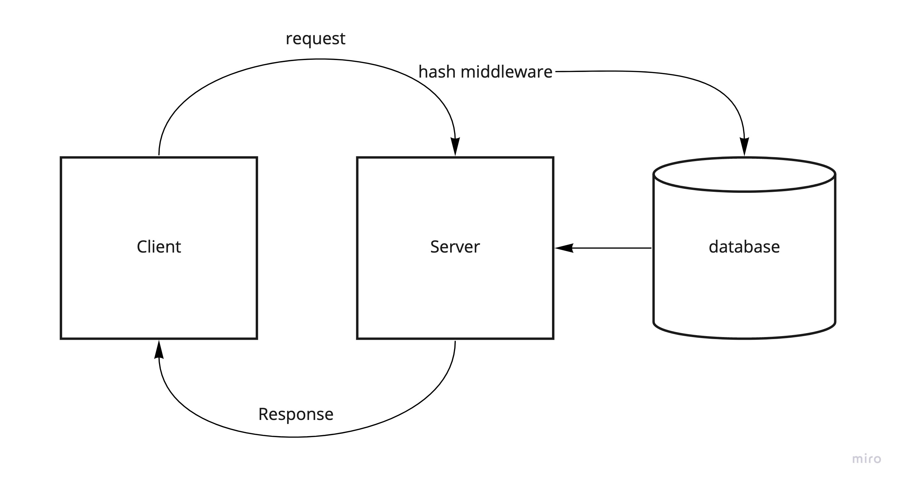

# basic-auth

## Current LAB - 06

## Authentication

You have been supplied a “monolithic” express server in the starter-code folder which fulfills the above requirements. To complete the work for this phase, refactor the provided server using best practices, modularizing the code and providing tests.

### Author: Mark Thanadabouth

### Collaborators: Jeremy B, Lorenzo O., Ayrat G.

#### Links and Resources

### Setup

#### `.env` requirements
- `PORT` - \<reference sample.env>
- `DATABASE_URL` - \<reference sample.env>

#### Running App
- `npm start` or `npx nodemon`

Endpoints:
- .get `/`
> Hello Main Server
- .post `/signup`
> Post user and password to database
- .post `/signin`
> Post a success if login is valid

#### Tests
- `npm test`

### UML
<!-- >  -->

### Reflections and Comments
* Start date (10/14)
* This lab was pretty tough

### LAB - 06

Name of feature: Phase 1

Estimate of time needed to complete: 12 Hours

Start time: 7pm(10/13)

Finish time: 8pm(10/14)

Actual time needed to complete: 12 hours
